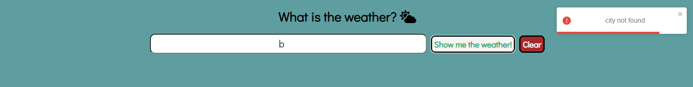

## FrondEnd Whether App with redux thunk

---

### Technologies in use - 👩‍💻👨‍💻

- **[React](https://reactjs.org/)**
- **[Redux](https://redux.js.org/)**
- **[Redux-thunk](https://github.com/reduxjs/redux-thunk)**

#### Packages

- **[Font-Awesone](https://fontawesome.com/) -For icons**
- **[React-toastify](https://fkhadra.github.io/react-toastify/introduction/) - for nice popUp messages**
- **[Moment](https://momentjs.com/) - For Nice dates display**
- **[gh-pages](https://github.com/gitname/react-gh-pages) - For deployment**

#### Api -

- **[Weather Data](https://openweathermap.org/forecast5) - For the weather info**

---

## My app -

### Visit - ✨(My weather app)[https://ramabadash.github.io/Weather-App-/]✨

### Features -

#### Search 🔎

- **You can search by name of any city you want**
- **Search bar with auto-completion for about 239 capital cities!😱**
- **To search, click on the green button**

#### Clean 🧹

- **You can clear the search bar and the search so far with the red button**

#### Errors

- **Nice pop-up messages informing you of an error.**

#### Info ℹ

- **Shows weather forecast for about 5 days starting today (today as well as 24 hours from now, 48 hours and so on)🌞⛅🌦**
- **Nice pictures illustrating the expected weather**
- **The state flag to which the city belongs to**

---

## Screenshots 📸 -

## 

## 
